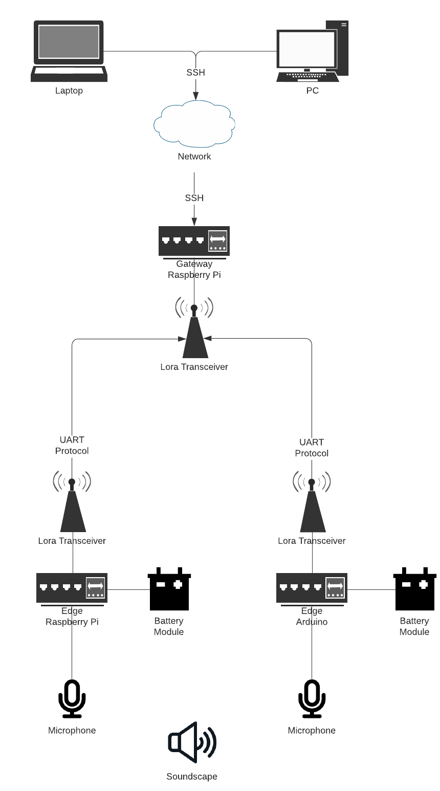

# IoT Architecture

The developed IoT system will be made up of many hardware parts that work together
to achieve the overall goal, to classify animals using sound. The architecture is designed
to support two different solution platforms Raspberry Pi and Arduino. The design takes into
account the following requirements: ability to transmit messages wirelessly,
be self-powered, take audio inputs and ability to run Machine Learning models.

## IoT Architecture Design

### Overall Architecture

The architecture starts at the two different edge solutions, Raspberry Pi and Arduino
which will be deployed in the wild. Both of them will have identical architecture
but with different hardware. Firstly, the Arduino and RPI hardware themselves will
be responsible for classifying data and will run the Machine Learning model. They
will also have a microphone that will be used to listen to environment sounds.
As they will be deployed remotely, they will have their own rechargeable battery module.
Lastly, both edge devices will have a Lora Transceiver that will send classification
results as radio messages over to the gateway.

There will be a second Raspberry Pi that will act as a gateway. It will be located
close to the deployer and will be connected to the same network as deployer's computer
machine. The RPI gateway will have its own Lora transceiver that will listen to edge devices'
messages and store them locally. The deployer will then be able to connect to the gateway
at any time it suits them using SSH network protocol to retrieve the classification results.

#### Note on Lora Transceivers

To be able to transfer/receive messages using Lora transceivers, they have to be
working on the same frequency band. During project development, the ordered Lora transceivers
only support communication over 433 MHz which is a license free frequency band in United Kingdom
however it is not in Malaysia (where the project will be deployed) according to [The Things Network](https://www.thethingsnetwork.org/docs/lorawan/frequencies-by-country/). There has been difficulty
finding Lora Transceivers with Malaysian licence free frequency band at EU suppliers.
It has been advised to search for Lora Transceiver modules at Asian suppliers before
deploying the project in Malaysia.

#### IoT Architecture Diagram

### List of Hardware

This is a list of hardware that will be ordered for the IoT architecture, this includes
extra hardware that will be used during the development.

#### Edge Raspberry Pi
* Raspberry Pi 4 Model B 4 GB - https://thepihut.com/products/raspberry-pi-4-model-b?variant=20064052740158
* 3000 mAh rechargeable battery for RPI - https://thepihut.com/collections/raspberry-pi-power-supplies/products/lipo-battery-hat-for-raspberry-pi
* Microphone - https://thepihut.com/products/mini-usb-microphone
* A swivel allowing microphone to be outside of the case pointed to a specific direction - https://thepihut.com/products/flexible-usb-swivel-adapter
* Micro SD Card 32 GB - https://thepihut.com/products/noobs-preinstalled-sd-card?variant=20649315598398
* Micro SD Adapter - https://thepihut.com/products/official-raspberry-pi-microsd-adapter?variant=35567127633
* Power Supply for development- https://thepihut.com/products/raspberry-pi-psu-uk?variant=20064004505662
* Micro-HDMI cable for development - https://thepihut.com/products/micro-hdmi-to-standard-hdmi-a-cable?variant=31597425000510
* 433 MHz Lora Hat Module - https://thepihut.com/products/sx1268-lora-hat-for-raspberry-pi-433mhz

#### Edge Arduino

NOTE - Grove Shield will be used as a bridge to connect Lora Module to the Arduino.

* Arduino Nano 33 BLE Sense (built in microphone)- https://thepihut.com/products/arduino-nano-33-ble-sense-with-headers
* Battery holder for Arduino - https://thepihut.com/products/microusb-battery-holder-3xaa
* AA batteries - https://thepihut.com/products/alkaline-aa-batteries-lr6-4-pack
* Micro-USB cable for development - https://thepihut.com/products/raspberry-pi-micro-usb-cable
* Grove Shield v1.1 version - https://www.seeedstudio.com/Grove-Shield-for-Arduino-Nano-p-4112.html
* 433 MHz Grove Lora Module - https://thepihut.com/products/grove-lora-radio-433mhz

#### Gateway Raspberry Pi
* 433 MHz Lora Hat Module - https://thepihut.com/products/sx1268-lora-hat-for-raspberry-pi-433mhz
* Raspberry Pi 4 Model B 2GB RAM - https://thepihut.com/products/raspberry-pi-4-model-b?variant=20064052674622
* Micro SD Card 32GB - https://thepihut.com/products/noobs-preinstalled-sd-card?variant=20649315598398
* Power Supply - https://thepihut.com/products/raspberry-pi-psu-uk?variant=20064004505662
